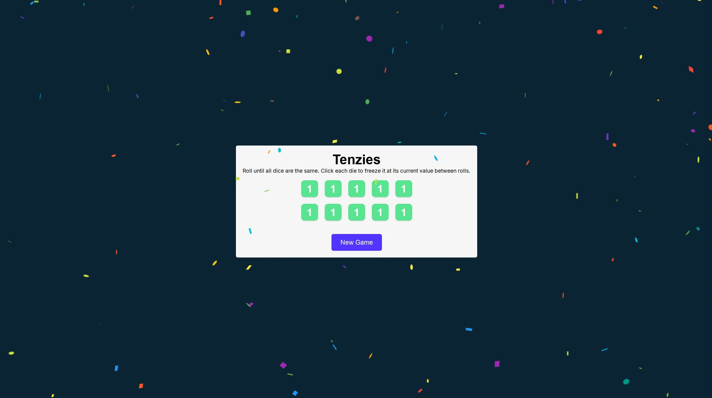

# Tenzi

## Description

The world’s fastest game! Everyone gets ten dice. Someone says, “Go.” Then everyone rolls and rolls as fast as they can until someone gets all their dice on the same number and shouts “TENZI.” Lots of different ways to play. A fun fast frenzy for the whole family!

## Technologies Used

- Vite
- .jsx
- JavaScript (ES6)
- CSS3

## Links

- [Deployed Site](https://tenzi-game.netlify.app/)

## What was done

- Created a tenzi game using JavaScript and HTML.
- Created a dice roll function that randomly generates numbers between one and six.
- Created a tenzi function that checks to see if the user has won by getting all their dice on the same number.
- Created a reset button that resets the game back to its original state.

## What I learned

- Conditional rendering
- useState
- useEffect

## To do list

- Add multiplayer functionality to the game.-
- Create a scoreboard that keeps track of how many times each player has won.
- Create a modal that displays when someone wins and shows the winner’s name.
- Create a modal that displays when someone loses and shows the loser’s name.
- Create a modal that displays when there is a tie and shows who tied.
- Create a modal that displays when the user clicks the reset button.
- Create a modal that displays when the user wins by clicking the reset button.
